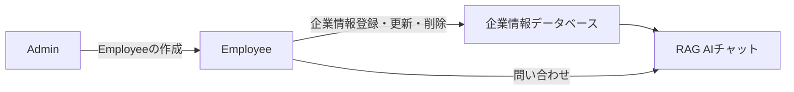

# Knowledge Hub

Knowledge Hub is a RAG (Retrieval-Augmented Generation) AI chat application designed for enterprise knowledge management. It allows organizations to store, manage, and query their enterprise information through an intelligent AI-powered chat interface.

## Features

### 🔐 Role-Based Access Control
- **Admin Role**: Employee account creation and management
- **Employee Role**: Enterprise data management and AI chat access

### 📊 Enterprise Data Management
- Create, update, and delete enterprise information
- Structured data storage for rooms, facilities, amenities
- Automatic vector embedding generation for AI search

### 🤖 RAG AI Chat System
- Natural language queries against enterprise data
- Real-time streaming responses
- Context-aware answers based on stored knowledge
- Chat history and conversation management

## System Architecture



## Technology Stack

- **Backend**: Ruby on Rails 8.0
- **Database**: PostgreSQL with pgvector extension
- **AI/ML**: ruby_llm gem for LLM integration
- **Vector Search**: neighbor gem with cosine similarity
- **Authentication**: Devise
- **Real-time**: Turbo Streams for live chat updates
- **Frontend**: Stimulus, Simple Form
- **Deployment**: Kamal with Docker

## Requirements

- Ruby 3.4.1
- PostgreSQL with pgvector extension
- Node.js for asset compilation

## Setup

1. **Install dependencies**
   ```bash
   bundle install
   yarn install
   ```

2. **Database setup**
   ```bash
   rails db:create
   rails db:migrate
   rails db:seed
   ```

3. **Environment configuration**
   ```bash
   # Configure your LLM API credentials
   cp .env.example .env
   # Edit .env with your settings
   ```

4. **Start the application**
   ```bash
   bin/dev
   ```

## Usage

### Admin Functions
1. Sign in as admin
2. Create employee accounts
3. Manage system settings

### Employee Functions
1. Sign in as employee
2. Add/update enterprise information (rooms, facilities, amenities)
3. Use AI chat to query information
4. View chat history

## Key Components

### RAG System
The core RAG implementation consists of:
- **Vector Search**: Similarity search using pgvector
- **Embedding Service**: Text-to-vector conversion
- **Chunk Generator**: Structured data formatting
- **RAG Service**: Query processing and response generation

### Data Models
- **Admin/Employee**: User management with Devise
- **Knowledge Chunks**: Vector storage for enterprise data
- **Chat/Messages**: Conversation history
- **Enterprise Models**: Rooms, facilities, amenities, categories

## Documentation

For detailed technical documentation and implementation details, see:
- [Architecture Documentation](docs/architecture.md)
- [Zenn Article](docs/zenn-article.md) - Comprehensive development story

## Deployment

The application is configured for deployment using Kamal:

```bash
kamal setup
kamal deploy
```

## Contributing

1. Fork the repository
2. Create a feature branch
3. Make your changes
4. Submit a pull request

## License

This project is proprietary software developed for internal enterprise use.
