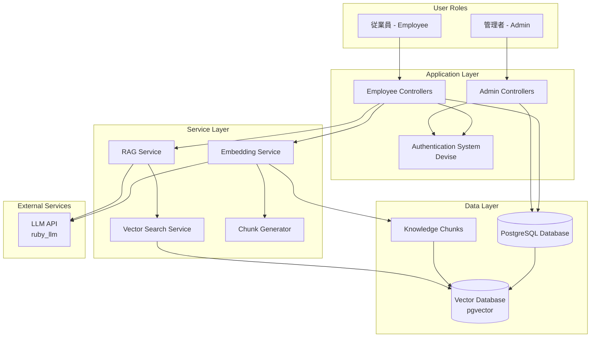

# Knowledge Hub System Architecture

## Overview

Knowledge Hub is a RAG (Retrieval-Augmented Generation) AI chat application designed for enterprise knowledge management.

## System Flow Diagram

## Component Descriptions

### User Roles
- **Admin (管理者)**: Manages employee accounts and system administration
- **Employee (従業員)**: Manages enterprise data and interacts with RAG AI chat

### Application Layer
- **Admin Controllers**: Handle admin-specific operations
- **Employee Controllers**: Handle employee data management and chat operations
- **Authentication System**: Devise-based authentication and authorization

### Service Layer
- **RAG Service**: Core service that handles AI chat interactions
- **Embedding Service**: Converts text data into vector embeddings
- **Vector Search Service**: Performs similarity search on vector data
- **Chunk Generator**: Formats structured data into text chunks for embedding

### Data Layer
- **PostgreSQL Database**: Main relational database for user data, chats, messages
- **Vector Database (pgvector)**: Extension for storing and searching vector embeddings
- **Knowledge Chunks**: Structured storage of enterprise information as vectors

### External Services
- **LLM API**: Language model integration via ruby_llm gem

## Data Flow

1. **Data Ingestion**: Employee creates/updates enterprise data
2. **Chunk Generation**: Data is formatted into searchable text chunks
3. **Embedding Creation**: Chunks are converted to vector embeddings via LLM
4. **Vector Storage**: Embeddings stored in pgvector database
5. **Query Processing**: User asks question through chat interface
6. **Similarity Search**: Query converted to embedding and similar chunks retrieved
7. **Context Assembly**: Retrieved chunks assembled as context
8. **Response Generation**: LLM generates response based on context and query
9. **Real-time Delivery**: Response streamed to user via Turbo channels

## Security Model

- Role-based access control (Admin vs Employee)
- Namespace separation for different user types
- Devise authentication with confirmation
- Secure API integrations

## Technology Stack

- **Backend**: Ruby on Rails 8.0, PostgreSQL, pgvector
- **AI/ML**: ruby_llm gem, vector embeddings
- **Frontend**: Turbo, Stimulus, Simple Form
- **Deployment**: Kamal, Docker
- **Authentication**: Devise