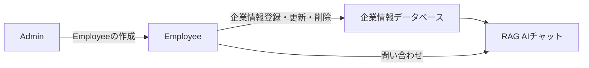

# Knowledge Hub: 企業情報検索のためのRAG AIチャットアプリ開発記録

## はじめに

私たちのチームは、NotebookLMのようなRAG AIチャットアプリを開発しました。
社内向けのアプリを想定しており、膨大な企業情報をベクトルデータベースとして格納し、トレーニングや普段の業務で気軽に企業情報を検索できるようにするのが狙いです。

## ターゲットユーザーと課題

企業情報のデータ量は業種によりますが、膨大となるのが一般的です。
それらを新入社員にトレーニングしなければならず、あるいは顧客対応で必要となる情報がすぐに欲しい時があるでしょう。
検索機能や手軽な扱いはメリットですが、複製が容易なため、似たような名前のファイルが乱立することも事実です。

私たちの会社では、スプレッドシートに情報を格納しており、カテゴリーはシート毎で管理しています。
シートの名前からカテゴリーを見分け、その中から欲しい情報を探すわけですが、保存方法にルールはなく書き方や保存方法もさまざまです。
使い方に慣れるとどの情報がどこにあるのか、おおよその見当はつきますが、新入社員にとってはハードルとなるでしょう。

そうした課題を解決するべく、Knowledge Hubの開発の構想を立て、今後はこのアプリを通して企業内でのトレーニングに活かすこともでき、統一された管理のもとで情報を保管することが可能になります。
「Knowledge Hub」は、気軽に情報を取得でき、情報の重複を排除し、常に最新の情報にアクセスできる利点を活かしたアプリです。

## 課題へのソリューションと特徴

前項で述べた課題を解決するべく実装した機能を、主に3つに分けて実装しました。

1. **従業員アカウント作成の機能** => 管理者(admin)だけが操作できる機能。
2. **企業情報の新規登録・更新・削除機能** => 従業員(employee)が操作できる機能。
3. **RAG AIを搭載したチャットアプリ機能** => 従業員(employee)が操作できる機能。

## システムアーキテクチャ



### システム構成要素

#### 1. 管理者機能 (Admin)
- 従業員アカウントの作成・管理
- システム全体の管理権限

#### 2. 従業員機能 (Employee)
- 企業情報の登録・更新・削除
- RAG AIチャットによる情報検索・問い合わせ

#### 3. データベース構造
- **ベクトルデータベース**: 企業情報を埋め込みベクトルとして保存
- **リレーショナルデータベース**: ユーザー管理、チャット履歴など

## 技術実装の詳細

### RAG (Retrieval-Augmented Generation) システム

Knowledge Hubの中核となるのは、RAGシステムです。これにより、大量の企業情報から関連性の高い情報を取得し、それをもとにAIが自然な回答を生成します。

#### ベクトル検索の実装

```ruby
class VectorSearch
  def self.search_by_similarity(query_text, limit: 5)
    query_embedding = RubyLLM.embed(query_text, dimensions: 1536).vectors
    KnowledgeChunk.nearest_neighbors(:embedding, query_embedding, distance: :cosine).limit(limit)
  end
end
```

#### RAGサービスの核心部分

```ruby
class RagService
  def self.answer(chat_id, query)
    chat = Chat.find(chat_id)
    user_message = chat.messages.create!(role: :user, content: query)
    
    # ベクトル検索で関連情報を取得
    chunks = VectorSearch.search_by_similarity(query, limit: 5)
    context = chunks.map(&:content).join("\n---\n")
    
    # プロンプト構築
    prompt_full = <<~PROMPT
      以下のホテル情報を参考にして、ユーザーの質問に答えてください。
      コンテキスト: #{context}
      ユーザーの質問: #{query}
    PROMPT

    # LLMによる回答生成
    llm_chat = RubyLLM.chat
    full_response = +""
    
    llm_chat.ask(prompt_full) do |chunk|
      if chunk.content.present?
        full_response << chunk.content
        # リアルタイムでフロントエンドに配信
        Turbo::StreamsChannel.broadcast_append_to(
          "chat_#{chat.id}",
          target: "message_#{user_message.id}_content",
          html: ActionController::Base.helpers.simple_format(chunk.content)
        )
      end
    end

    chat.messages.create!(role: :assistant, content: full_response)
  end
end
```

### 埋め込みベクトル生成

企業情報をベクトル化するための仕組み：

```ruby
class EmbeddingService
  def self.create_for_roomlists(room)
    content = ChunkGenerator.roomlists_chunk(room)
    embedding = RubyLLM.embed(content, dimensions: 1536).vectors

    KnowledgeChunk.create!(
      content: content,
      embedding: embedding
    )
  end
end
```

### チャンク生成

構造化された情報をテキストチャンクに変換：

```ruby
class ChunkGenerator
  def self.roomlists_chunk(room)
    <<~TEXT
      ルームタイプ: #{room.room_type_name}
      サイズ: #{room.square_meters} sqm
      容量: #{room.capacity} guests
      ベッドタイプ: #{room.bed_type}
      ベッド数: #{room.bed_quantity}
      HTWN: #{room.htwn ? 'Yes' : 'No'}
      ルームカテゴリー: #{room.room_category.name}
      アメニティーグループ: #{room.amenity_group.name}
      アメニティーグループの説明: #{room.amenity_group.content}
    TEXT
  end
end
```

## 使用技術

### バックエンド
- **Ruby on Rails 8.0**: メインフレームワーク
- **PostgreSQL**: メインデータベース
- **pgvector**: ベクトル検索拡張
- **neighbor gem**: ベクトル近傍検索
- **ruby_llm gem**: LLM統合
- **Devise**: 認証システム

### フロントエンド
- **Turbo**: リアルタイム更新
- **Stimulus**: JavaScript フレームワーク
- **Simple Form**: フォーム構築

### インフラ・デプロイ
- **Kamal**: デプロイツール
- **Docker**: コンテナ化

## データベース設計

### 主要テーブル

#### 管理者・従業員テーブル
```sql
-- 管理者
CREATE TABLE admins (
  id SERIAL PRIMARY KEY,
  email VARCHAR UNIQUE NOT NULL,
  encrypted_password VARCHAR NOT NULL,
  created_at TIMESTAMP,
  updated_at TIMESTAMP
);

-- 従業員
CREATE TABLE employees (
  id SERIAL PRIMARY KEY,
  name VARCHAR NOT NULL,
  email VARCHAR UNIQUE NOT NULL,
  encrypted_password VARCHAR NOT NULL,
  confirmed_at TIMESTAMP,
  created_at TIMESTAMP,
  updated_at TIMESTAMP
);
```

#### ナレッジチャンクテーブル
```sql
CREATE TABLE knowledge_chunks (
  id SERIAL PRIMARY KEY,
  title VARCHAR,
  content TEXT,
  embedding VECTOR(1536), -- 1536次元のベクトル
  created_at TIMESTAMP,
  updated_at TIMESTAMP
);
```

#### チャット関連テーブル
```sql
CREATE TABLE chats (
  id SERIAL PRIMARY KEY,
  employee_id INTEGER REFERENCES employees(id),
  title VARCHAR,
  model_id VARCHAR,
  created_at TIMESTAMP,
  updated_at TIMESTAMP
);

CREATE TABLE messages (
  id SERIAL PRIMARY KEY,
  chat_id INTEGER REFERENCES chats(id),
  role VARCHAR, -- 'user' or 'assistant'
  content TEXT,
  model_id VARCHAR,
  input_tokens INTEGER,
  output_tokens INTEGER,
  created_at TIMESTAMP,
  updated_at TIMESTAMP
);
```

## 実装のポイント

### 1. セキュリティ
- 管理者と従業員の権限分離
- Deviseによる認証
- 名前空間による機能分離

### 2. パフォーマンス
- ベクトル検索の最適化
- チャット応答のストリーミング
- 効率的なデータベース設計

### 3. ユーザビリティ
- リアルタイムチャット体験
- 直感的な管理画面
- レスポンシブデザイン

## 今後の展望

### 機能拡張
- ファイルアップロード機能
- より詳細な検索フィルタ
- チャット履歴の分析機能

### 技術的改善
- より高度なRAG手法の導入
- マルチモーダル対応
- スケーラビリティの向上

## まとめ

Knowledge Hubは、企業の知識管理における課題を解決するRAG AIアプリケーションです。
従来のスプレッドシートベースの情報管理から脱却し、AIを活用した効率的な情報検索システムを実現しました。

特に以下の点で価値を提供しています：

1. **情報の統一管理**: 散在していた企業情報を一元管理
2. **自然言語による検索**: 専門知識がなくても直感的に情報を検索
3. **役割ベースのアクセス制御**: 管理者と従業員の権限分離
4. **リアルタイム性**: 即座に最新情報にアクセス可能

このシステムにより、新入社員のトレーニング効率化や日常業務での情報アクセスの改善を実現し、企業全体の生産性向上に貢献しています。